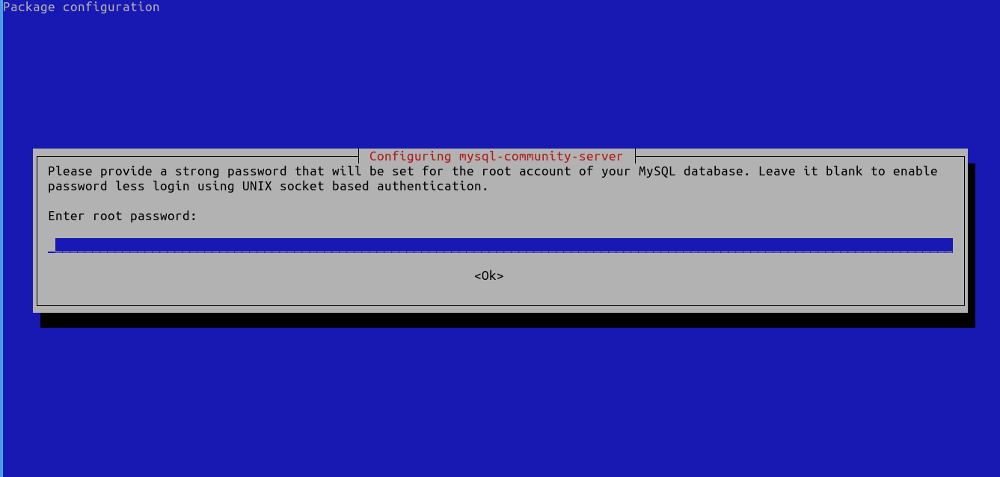

# MySQL 5.7/8.0 in Debian 10

## Step 1 - Update System and Install GNUPG

```text
apt update
apt upgrade -y
apt install gnupg -y
```

## Step 2 - Added New PPA

```text
wget http://repo.mysql.com/mysql-apt-config_0.8.14-1_all.deb
dpkg -i mysql-apt-config_0.8.14-1_all.deb
```

* Choose version you're MySQL




* Then update system for get fetch mysql repository

  ```bash
  apt update
  ```

## Step 3 - Install MySQL

```bash
apt install mysql-server -y
```

## Step 4 - Check Status

```bash
systemctl status mysql
```

Output :

```bash
systemctl status mysql
● mysql.service - MySQL Community Server
   Loaded: loaded (/lib/systemd/system/mysql.service; enabled; vendor preset: enabled)
   Active: active (running) since Sun 2019-12-01 14:16:22 EST; 11min ago
 Main PID: 13560 (mysqld)
    Tasks: 27 (limit: 2302)
   Memory: 182.7M
   CGroup: /system.slice/mysql.service
           └─13560 /usr/sbin/mysqld --daemonize --pid-file=/var/run/mysqld/mysqld.pid

Dec 01 14:16:22 db-test systemd[1]: Starting MySQL Community Server...
Dec 01 14:16:22 db-test systemd[1]: Started MySQL Community Server...
```

## Step 5 - Secure MySQL Installation

```bash
mysql_secure_installation
```

Output :

```text
# mysql_secure_installation

Securing the MySQL server deployment.

Enter password for user root: 

VALIDATE PASSWORD PLUGIN can be used to test passwords
and improve security. It checks the strength of password
and allows the users to set only those passwords which are
secure enough. Would you like to setup VALIDATE PASSWORD plugin?

Press y|Y for Yes, any other key for No:  
Using existing password for root.
Change the password for root ? ((Press y|Y for Yes, any other key for No) : 

 ... skipping.
By default, a MySQL installation has an anonymous user,
allowing anyone to log into MySQL without having to have
a user account created for them. This is intended only for
testing, and to make the installation go a bit smoother.
You should remove them before moving into a production
environment.

Remove anonymous users? (Press y|Y for Yes, any other key for No) : y
Success.


Normally, root should only be allowed to connect from
'localhost'. This ensures that someone cannot guess at
the root password from the network.

Disallow root login remotely? (Press y|Y for Yes, any other key for No) : y
Success.

By default, MySQL comes with a database named 'test' that
anyone can access. This is also intended only for testing,
and should be removed before moving into a production
environment.


Remove test database and access to it? (Press y|Y for Yes, any other key for No) : y
 - Dropping test database...
Success.

 - Removing privileges on test database...
Success.

Reloading the privilege tables will ensure that all changes
made so far will take effect immediately.

Reload privilege tables now? (Press y|Y for Yes, any other key for No) : y
Success.

All done!
```

## Step 6 - Testing

```bash
mysql -u root -p
```

Output :

```text
$ 0mysql -u root -p
Enter password: 
Welcome to the MySQL monitor.  Commands end with ; or \g.
Your MySQL connection id is 4
Server version: 5.7.28 MySQL Community Server (GPL)

Copyright (c) 2000, 2019, Oracle and/or its affiliates. All rights reserved.

Oracle is a registered trademark of Oracle Corporation and/or its
affiliates. Other names may be trademarks of their respective
owners.

Type 'help;' or '\h' for help. Type '\c' to clear the current input statement.

mysql>
```

